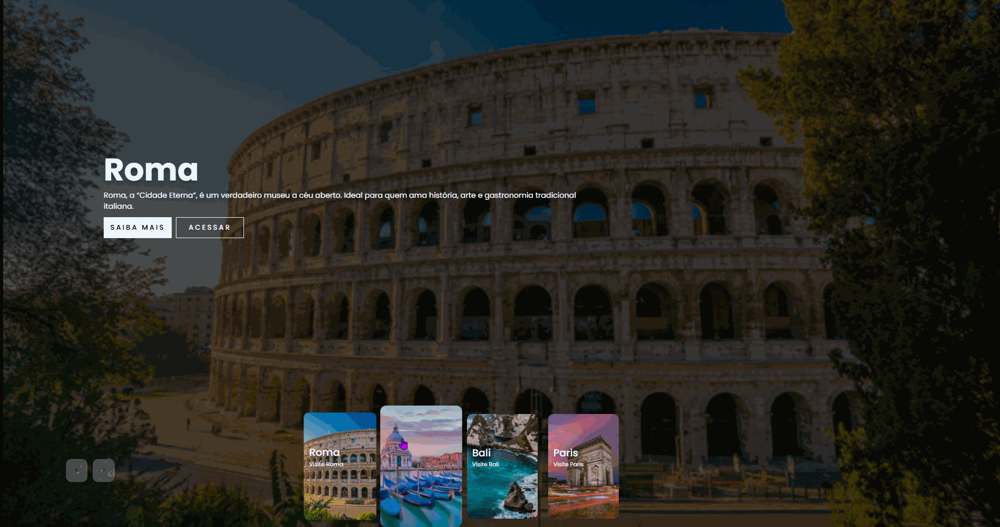

# carrossel-destinos
Carrossel de destinos turísticos interativo, com animações suaves, thumbs clicáveis e conteúdo dinâmico. Navegue por Bali, Paris, Roma e Veneza com efeitos de hover, animação do texto e responsividade para desktop e mobile. Desenvolvido com HTML, CSS e JavaScript.
# 🌍 Carrossel de Destinos Turísticos

Um site interativo de carrossel de destinos turísticos com animações suaves, thumbs interativos e conteúdo dinâmico. Navegue por Bali, Paris, Roma e Veneza com efeitos de hover e animação do texto, totalmente responsivo.

---

## 🎬 Demonstração

---

## 🌐 Link do site

O site estará disponível no GitHub Pages:  
`https://seu-usuario.github.io/nome-do-repositorio/`  

*(Substitua pelo link real quando estiver publicado)*

---

## 🎯 Funcionalidades

- Navegação por **botões avançar/voltar** com animação suave.  
- **Thumbnails interativos** que expandem ao passar o mouse.  
- **Conteúdo animado** para cada destino (título, descrição e botões).  
- **Responsivo**: desktop, tablet e mobile.  
- Último thumb pode expandir além do container sem gerar overflow.

---

## 📂 Estrutura do projeto

carrossel-destinos/
│
├─ index.html # Estrutura HTML do carrossel
├─ style.css # Estilos do site e animações
├─ script.js # Lógica do carrossel e hover nos thumbs
├─ assets/
│ └─ slider.gif # GIF de demonstração
└─ README.md # Documentação do projeto
